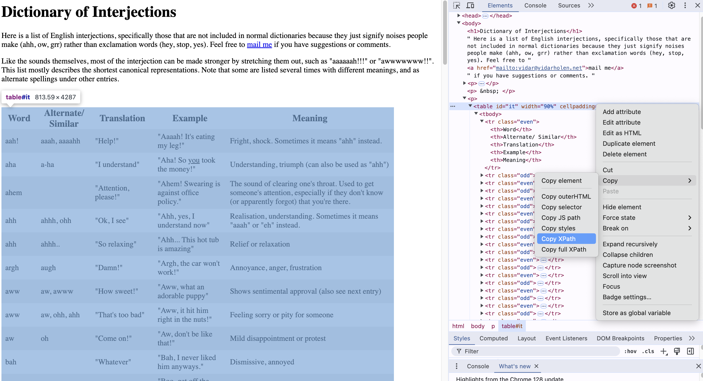

--- 
title: "A Guide To Surviving Big Data and Psychological Science"
author: "Joshua Hew and Jana Tomastikova"
date: "`r Sys.Date()`"
site: bookdown::bookdown_site
documentclass: book
bibliography: [book.bib, packages.bib]
# url: your book url like https://bookdown.org/yihui/bookdown
# cover-image: path to the social sharing image like images/cover.jpg
description: |
  This is a minimal example of using the bookdown package to write a book.
  The HTML output format for this example is bookdown::gitbook,
  set in the _output.yml file.
link-citations: yes
github-repo: rstudio/bookdown-demo
---

# Introduction

There's courses you don't have to worry about too much and then there is Big Data. This (unofficial) guide offers some basic tools and strategies that we think you might find useful, so that you put your amazing research ideas into work without getting stuck on the practical bits (although you will most likely get stuck anyways). This is by no means all you should know or all you should expect you should know (and not officially a part of the course content). These are just some things that previous students on the course found important to know. We hope it helps.

## How to use this guide 

Just flick through the pages and find whatever is useful to you.

## General strategies for the course

This course is hard so prepare to kiss your first class honours goodbye. But if you put the effort in, it's highly rewarding, no matter what mark you get.

 - The main part of the course is your research project, which is grounded in what you learn in the lectures and tutorials (so you better show up to them).

 - Participate, ask questions, talk to Zach, he's there to help (and we are here too).

 - You will learn by doing (and googling when things don't work - follow on to the next section).

## How to search for stuff you don't understand 

1. Learn how to read documentation for libraries/functions, most can be found on CRAN.

  - you can search a function in the documentation by typing this into the console:

```{r}
?cor.test
```

  - you can also use two question marks to search the documentation for a word or a phrase:
  
```{r}
??tokenize
```

2. Most packages have a tutorial or readme document that explains how and when to use them. (search for them!)

3. ChatGPT can help with code but using it means you won't actually understand the code. Better to just follow a tutorial and implement it yourself. 


## About us 

```{r echo=FALSE, out.width = '350px', fig.align='center'}
knitr::include_graphics('./assets/joshua_pic.jpg')
```

<center>
Joshua (s2144522@ed.ac.uk)
</center>
<br>

```{r echo=FALSE, out.width = '350px', fig.align='center'}

```

<center>
Jana (s2158655@ed.ac.uk)
<br><br>

Do let us know if there are errors on this guidebook. We basically live in 7GS so feel free to approach whenever. 

Also, we survived the course.
</center>


<!-- This is a _sample_ book written in **Markdown**. You can use anything that Pandoc's Markdown supports; for example, a math equation $a^2 + b^2 = c^2$. -->

<!-- ## Usage  -->

<!-- Each **bookdown** chapter is an .Rmd file, and each .Rmd file can contain one (and only one) chapter. A chapter *must* start with a first-level heading: `# A good chapter`, and can contain one (and only one) first-level heading. -->

<!-- Use second-level and higher headings within chapters like: `## A short section` or `### An even shorter section`. -->

<!-- The `index.Rmd` file is required, and is also your first book chapter. It will be the homepage when you render the book. -->

<!-- ## Render book -->

<!-- You can render the HTML version of this example book without changing anything: -->

<!-- 1. Find the **Build** pane in the RStudio IDE, and -->

<!-- 1. Click on **Build Book**, then select your output format, or select "All formats" if you'd like to use multiple formats from the same book source files. -->

<!-- Or build the book from the R console: -->

<!-- ```{r, eval=FALSE} -->
<!-- bookdown::render_book() -->
<!-- ``` -->

<!-- To render this example to PDF as a `bookdown::pdf_book`, you'll need to install XeLaTeX. You are recommended to install TinyTeX (which includes XeLaTeX): <https://yihui.org/tinytex/>. -->

<!-- ## Preview book -->

<!-- As you work, you may start a local server to live preview this HTML book. This preview will update as you edit the book when you save individual .Rmd files. You can start the server in a work session by using the RStudio add-in "Preview book", or from the R console: -->

<!-- ```{r eval=FALSE} -->
<!-- bookdown::serve_book() -->
<!-- ``` 
<!-- ```{r include=FALSE} -->
<!-- # automatically create a bib database for R packages
knitr::write_bib(c(
  .packages(), 'bookdown', 'knitr', 'rmarkdown'
), 'packages.bib')
```

<!--chapter:end:index.Rmd-->

# Common Functions 

```{r include=FALSE}
library(tidyverse)
```


## For working with dataframes

I've scraped some data from r/psychologystudents so we can explore what we like to complain about. 

```{r include=FALSE}
psych_df <- read.csv("data/psychologystudents_20240820.csv")
```

```{r}
head(psych_df)
```

That's a bit chunky, why not we get rid of some variables? 

### select()

The select() function allows you retain specific columns (variables) by name from a dataframe. 

```{r}
psych_df %>%
  select(title) %>%
  head()
```

You can also pick out multiple columns by adding more arguments to the select() function.

```{r}
psych_df %>%
  select(score, id, subreddit) %>%
  head()
```

You can also retain columns by their numerical order. Here, the score, id, and subreddit are columns 3, 4, and 5 respectively.

```{r eval=FALSE}
psych_df %>%
  select(c(3:5)) %>%
  head()
```

### filter()

Recall that to call upon specific rows we can do this: 

```{r}
psych_df[4:7,] %>%
  select(title)
```

Which outputs rows 4 to 7.  

The filter function allows you to select specific rows that fit one or multiple criterion in your dataframe.

To get titles that have a Reddit score of 25 or more:

```{r}
psych_df %>%
  filter(score > 25) %>%
  select(title, score)

```

You can also input multiple logical conditions by adding more operators such as & or |. 
For a score of more than 25 and a "Discussion" flair. 

```{r}
psych_df %>%
  filter(score > 25 & flair == "Discussion") %>%
  select(title, score, flair) 
```

For a score of 100 or more OR a "Study Megathread" flair. 

```{r}
psych_df %>%
  filter(score >= 100 | flair == "Study Megathread") %>%
  select(title, score, flair)
```

### arrange()

Say I would like to look at 5 entries with the highest score. We can use arrange() and the function desc() to sort the text entries in a descending order:

```{r}
psych_df %>%
  select(title, score) %>%
  arrange(desc(score))%>%
  head(5)
```

5 lowest scoring entries? Arrange() sorts the dataframe in ascending order by default:

```{r}
psych_df %>%
  select(title, score) %>%
  arrange((score))%>%
  head(5)
```

Oh, seems like there might be more than 5 entries that scored a zero. Let's count how many using count():

```{r}
psych_df %>%
  filter(score==0) %>%
  count(score)
```

Seems like there are 8 entries with the score of 0.

### rbind()

This function is a super useful one. It binds rows of two or more dataframes together. Let's say I have these two dataframes:

```{r, include=FALSE}
name <- c("Bellatrix Lestrange","Basilisk","Voldemort","Barty Crouch Sr.","Professor Quirrell")
died <- c("Deathly Hallows","Chamber of Secrets","Deathly Hallows","Goblet of Fire","Philosopher's Stone")
bad_people <- data.frame(name,died)

name <- c("Cedric Diggory","Remus Lupin","Alastor Moody","Albus Dumbledore","Sirius Black")
died <- c("Goblet of Fire","Deathly Hallows","Deathly Hallows","Half Blood Prince","Order of the Phoenix")
good_people <- data.frame(name,died)
```

```{r}
good_people
```
```{r}
bad_people
```
Now it's time to use the rbind() function to bind the datasets together into one dataset. BUT, before we do that, it's good practice to add 


```{r}
hp_characters <- rbind(good_people,bad_people)
hp_characters
```
Great, so the rows of the second dataset (bad_people) were now added underneath the rows of the first dataset (good_people). But wait, what if someone doesn't know the characters that well so can't distinguish which characters are good or bad? It is good practice to add an extra column to each of the datasets beforehand so that you know where this data came from. Let's do that again:

```{r}
good_people <- good_people%>%
  mutate(identity="good")

bad_people <- bad_people%>%
  mutate(identity="bad")

hp_characters <- rbind(good_people,bad_people)
hp_characters
```

That's better.

### cbind()

This function is similar to rbind(), but instead of rows, it binds the columns (the c in cbind) of the datasets together. I have another dataset (actually just a column) that contains info about the house each of these characters are in:

```{r, include = FALSE}
house <- c("Hufflepuff","Gryffindoor","Unknown","Gryfindoor","Gryffindoor","Slytherin","NA","Slytherin","Unknown","Ravenclaw")

house_info <- data.frame(house)
```

```{r}
house_info
```

Let's add it to the hp_characters dataset.

```{r}
hp_characters_info <- cbind(hp_characters,house_info)
hp_characters_info
```

Note: Make sure that the number of rows match, otherwise you will get an error :/. 

Also, both the rows and the columns just get appended in the order that they are in. So make sure you double check that the data is as you want it to be.

### write.csv()

This function is good for when you want to save a dataset that you have created/cleaned in R to your computer as a csv file (which you can then put on OSF or something). This is the syntax:

```{r}
write.csv(hp_characters_info,"./data/filename.csv")
```

Note: The "./data/filename.csv" part of the argument specifies the path to the directory where you want to save it, ending with your chosen file name. If you don't specify the path, it will save it in your current directory.


## For working with text

Let's go back to the r/psychologystudents dataset and see what tools for working with text we can use.

### gsub()

This function let's you substitute a string or the characters in a vector or a dataframe with another string. It's very useful for data cleaning. For example, many big datasets of online comments usually contain a lot of links (URLs). In most cases, we are not interested in those links, as they might interfere with our analyses (although sometimes they might also be interesting). There is a way to get rid of/replace things we are not interested in.

The syntax of gsub() is the following:

**gsub(pattern, replacement, x)**
  
  - pattern: The pattern or the string that you want to replace
  - replacement: A string you want to input instead of the pattern.
  - x: the dataset/column you want the replacement to happen


If we wanted to replace all hashtags with a blank space (basically just get rid of them) in the body column of our dataframe, we could do this:

```{r}
psych_df$body <- gsub("#","",psych_df$body)
```


It gets more complicated if you want to do more complex things. You can replace multiple patterns, or work with something called Regular Expressions (we have a separate tab on what regular expressions are because it sort of has its own lore).

For some more advanced pattern matching with gsub(), click [here](https://sqlpad.io/tutorial/mastering-pattern-replacement-gsub/) or surf the internet.


Here is an example for how to get rid of URLs in the psych_df dataset:

```{r}
psych_df$body <- gsub("http\\S+|www\\S+|https\\S+", "", psych_df$body)
```

Breakdown of the syntax:

1. `http`: This matches the literal string "http".

2. `\\S+`:
  - `\\S` matches any non-whitespace character. (In R, the backslash is escaped by doubling it, so \\S becomes \S in regex, where S stands for non-whitespace.)
  - The `+` means "one or more" of the preceding character (i.e., one or more non-whitespace characters). This matches the rest of the URL after "http" (like http://example.com).
  
3. `|` (OR operator): This allows for multiple patterns to be matched. It means "or", so the regex will match either the first part before |, or the part after it.

4. `www:` This matches the literal string "www". This pattern is to catch URLs that start with "www" but might not have "http" or "https" at the beginning.

5. `\\S+` (again): Similar to the explanation above, this matches the non-whitespace part of the URL after "www".

6. `https`: This matches the literal string "https".

7. `\\S+`: Again, this matches the rest of the URL after "https".

The gsub() function then removes these matches (i.e., replaces them with an empty string "").

### unnest_tokens()

This is a very handy one and Zach for sure had already mentioned it. Unnest_tokens() splits your desired text column into "tokens", one token per row. A token could be one word, or two words, or three, or sentences, or so on. This function is a good start for when you want to, say, count the instances of certain words, or do more interesting analyses, like find which words are unique to specific groups or datasets.


The basic syntax looks like this:

**unnest_tokens(dataframe, output, input)**

  - output: Output column to be created as string or symbol. This is usually something like "words" or "ngram".
  - input: Input column that gets split as string or symbol. This is the name of your column you want split, usually "text" or "body".
  
Let's try it on our psych_df data:

```{r}
library(tidytext) # this is where the function comes from

unnested <- psych_df %>%
  unnest_tokens(word,body)
```

Let's have a look at the first 10 rows of our newly created words column.

```{r}
head(unnested,10)%>%
  select(word)
```

Each word has it's own row now.

Cool, let's count the words and look at the most used ones:

```{r}
unnested %>%
  count(words, sort=TRUE)%>%
  top_n(10, n) # selects the top 10 by the count
```

Wow, amazing insights. Anyways.
(this is where stop words come in)

Let's load in a dataset with stop words (a set of commonly used words that are usually not interesting)

```{r}
data(stop_words)
```

Now, we will delete these stop words from our dataset by using the anti_join() function (see the dplyr package in the Useful Package section).

```{r}
unnested <- unnested %>%
  anti_join(stop_words)
```

Let's see what the most used words are now:

```{r}
unnested %>%
  count(word, sort=TRUE)%>%
  top_n(10, n)
```


<!--chapter:end:01-functions.Rmd-->

# Useful Packages

- don't forget that to install a package, you type install.packages("tidyverse") into the console and then run this to load the package:

```{r}
library(tidyverse)
```

First, your good old friend:

## Tidyverse

is actually a package containing other packages that you will very likely use in most of your analyses. These core packages include:

  - ggplot2
  - dplyr
  - tidyr
  - readr
  - purrr
  - tibble
  - stringr
  - forcats
  
(but there's others too)
  
Let's have a look at some of the most useful ones.

### ggplot2

Great for plots! You have probably used it in DAPR already - you will use it in this course too. Usually, it starts with the function ggplot(), you then give it a dataset and specify what you want it to look like (aesthetic mapping) with aes(). Here is an example:

```{r,include=FALSE}
library(tidytext)

unnested <- psych_df %>%
  unnest_tokens(words,body)

data(stop_words)

stop_words <- stop_words %>%
  rename("words" = "word")

psych_words <- unnested %>%
  anti_join(stop_words)

psych_words <- psych_words %>%
  count(words, sort=TRUE)

psych_words <-  psych_words%>%
  filter(n > 30)%>%
  mutate(words = reorder(words,-n))

```

```{r}
ggplot(psych_words,aes(x=words,y=n))+
  geom_col(fill = "lightblue")+
  labs(title ="Most common words in the psych dataset")
```

Boring, but this is a plot that shows the most used words in our previous dataset (I did some data wrangling beforehand to create the psych_words dataframe - by tokenizing psych_df!).

Click [here](https://github.com/rstudio/cheatsheets/blob/main/data-visualization.pdf) to find a nice Data Visualization with ggplot2 cheatsheet.

### dplyr

A very very useful package for data handling. The most common functions from the package are:

  - mutate() = adds a new variable (column) to the dataframe
  - select() = picks out variables from a dataframe based on their name
  - filter() = picks out cases based on a condition
  - summarise() = gives you a summary of multiple values
  - arrange() = arranges rows in a dataset (usually asceding or descending order)
  
Some other functions you might see Zach using are "join" functions, which help you combine dataframes and retain certain values from each, depending on what you need. They are a bit confusing, but hopefully this explanation helps:

I have two dataframes here:

```{r, include=FALSE}
course <- c('DAPR2', 'Psych in Action', 'Big Data', 'Psych 1A', 'DAPR3')
avg_sleep <- c('7', '10', '4', '9','6')
sleep <- data.frame(course, avg_sleep)
```

```{r}
sleep
```

```{r, include = FALSE}
course <- c('DAPR2', 'Psych in Action', 'Big Data', 'Psych 1A', 'Critical Analysis')
n_students <- c('250','163','39','300','161')
students <- data.frame(course,n_students)
```

```{r}
students
```

Now let's see what the join functions do:

**1. inner_join()**

- keeps observations from the first dataframe that have a matching key in the second dataframe (NOTE: join_by() specifies what variable should be our matching variable)

```{r}
inner_join(sleep, students, join_by(course))
```

This one put the two dataframes together but left out Critical Analysis and DAPR3, because they are only in one of the two dataframes.

**2. left_join()**

- keeps all observations in the first dataframe.

```{r}
left_join(sleep, students,join_by(course))
```

This time, Critical Analysis is left out because it is only in the second dataframe.

**3. right_join()**

- keeps all observations in the second dataframe

```{r}
right_join(sleep, students,join_by(course))
```

So, DAPR3 is left out because it is in the first dataframe.


**4. full_join()**

- keeps all observations from both dataframes

```{r}
full_join(sleep, students,join_by(course))
```

Now we've got all the observations, but some have got missing values.

**5. anti_join()**

- keeps all observations from the first dataframe without a match in the second one.

```{r}
anti_join(sleep, students ,join_by(course))
```
Just DAPR3 is left from the first dataframe.

Again, you can check out a cheatsheet for the dplyr package [here](https://github.com/rstudio/cheatsheets/blob/main/data-transformation.pdf).


<!--chapter:end:02-packages.Rmd-->

# Tutorials 

```{r include=FALSE}
library(tidyverse)
library(rvest)
```


## Writing functions in R 


## Working with different datatypes (and how to convert between them)


## Regular expressions in R 


## Scraping data from HTML 

This tutorial is adapted from [Chris Bail's Screen-scraping in R](https://cbail.github.io/textasdata/screenscraping/rmarkdown/Screenscraping_in_R.html) & [Wickham et al.'s R for Data Science](https://r4ds.hadley.nz/webscraping). 

We'll be using the package [rvest](https://rvest.tidyverse.org/index.html) to scrape information from html pages, which is useful for information contained within tables such as this [Interjection dictionary](https://cran.r-project.org/web/packages/rvest/vignettes/rvest.html) or the top movies on [IMDB](https://www.imdb.com/chart/top/).

Let's start with the table in [Interjection dictionary](https://cran.r-project.org/web/packages/rvest/vignettes/rvest.html). 

First, we'll read the entire html source code from the website we are interest into R. 

```{r}
interjections_html <- read_html("https://www.vidarholen.net/contents/interjections/") # Reading the entire page into R 
interjections_html
```

The result is html code, which is the programming language web developers use to define the structure and content of the website. In Google, you can inspect the html code of any website by right clicking with your cursor and pressing the "inspect" tab. Importantly, HTML code has a nested structure, typically including "head" a "body" sections of the webpage. The content are mostly contained within tags such as "p" (paragraph) and "h1" (heading 1), I won't go into too much detail what these are but feel free to look up any HTML tutorial to learn more about these elements.

```{r echo=FALSE, out.width = '800px', fig.align='center'}
knitr::include_graphics('./assets/html_inspect_screenshot.png')
```

Once you have the html code in R, you can use the html_nodes() function to specify what sort of elements you want to extract. For our purpose, we will specify "table":  

```{r}
interjections_dict1 <- interjections_html %>% 
  html_nodes("table") %>%
  .[[1]] %>% # Which table you want to extract (if there are multiple tables on a webpage)
  html_table()

head(interjections_dict1) # This gives you a dataframe that you can work with! 
```

Alternatively, you can specify an xpath to directly call the specific element you want to turn into a dataframe. You can find the xpath of an element by hovering over the HTML code that highlights the part of the website you want. For instance: 

```{r echo=FALSE, out.width = '800px', fig.align='center'}

```

Learn more about xpaths [here](https://www.w3schools.com/xml/xpath_syntax.asp).

```{r}
interjections_dict2 <- html_node(interjections_html, xpath = '//*[@id="it"]') %>% 
  html_table()
head(interjections_dict2)
```

### What if you wanted other information contained within a page? 

You can scrape specific elements of a webpage, depending on the HTML element you specify. Let's say you want to scrape all the text within paragraphs ("p") of [Sigmund Freud's Wikipedia](https://en.wikipedia.org/wiki/Sigmund_Freud) website. 

```{r}
freud_html <- read_html("https://en.wikipedia.org/wiki/Sigmund_Freud") %>% # Reading the entire wiki page into R 
  html_elements("p") %>% # Specify all "p" elements in the webpage
  html_text2() # Extract the text content of the HTML elements 

freud_html[[3]] # This gives you a list of all the paragraph text on the webpage
```

### Some caveats 

<b> Legality </b>

If the data is public, non-personal, and factual, it should be fine to scrape*. You should cite the websites you use, and always read the terms of conditions if present. 

<b> APIs </b> 

This short tutorial doesn't cover more dynamic websites, or websites that utilise an Application Programming Interface (API), which are a set of functions or procedures the website has specified to access their data. 

<!--chapter:end:03-tutorials.Rmd-->

# Datasets and Potential Project Ideas 

There's so much data to work with online. 

## Datasets 


## Project Ideas 


## What to look for in a project 

- In general, start with a dataset before determining your project idea or research question. Your findings are as good as your data. 


<!--chapter:end:04-datasets.Rmd-->

# Useful Resources 


<!--chapter:end:05-other.Rmd-->

